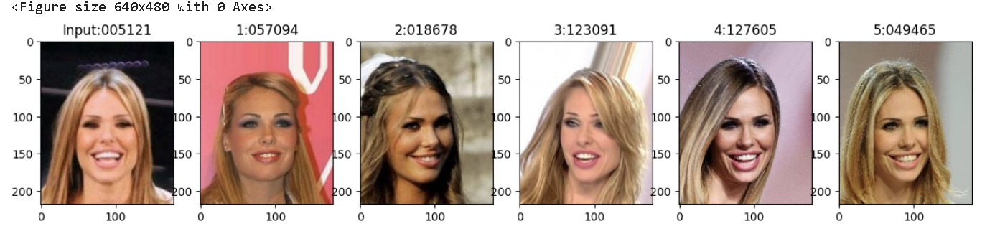

# Facial Recognition System Using Pre-trained FaceNet Model

A lightweight facial recognition system that uses embeddings generated by a **pre-trained FaceNet model** to find the 5 most similar faces to a given input image from a dataset of 12,000 facial images.

---

## 📚 Project Overview

- **Goal**: Given an input image, retrieve the 5 closest matching faces from a dataset, based on Euclidean distance between FaceNet-generated embeddings.
- **Dataset**: 12,000 facial images (40 individuals, ~300 images each) and an accompanying `id-pair.csv` file mapping image IDs to person IDs.
- **Model**: Pre-trained [FaceNet model](https://github.com/nyoki-mtl/keras-facenet) (no re-training required).

---

## 🛠 How it Works

1. **Embedding Generation (`img2vec`)**
   - Loads a pre-trained FaceNet model.
   - Processes an input image to extract a 128-dimensional normalized embedding vector.

2. **Face Matching (`imageFinder.ipynb`)**
   - For a given input image, computes Euclidean distances between its embedding and embeddings of all other dataset images.
   - Identifies the **5 nearest neighbors** based on these distances.

3. **Output**
   - Displays the query image along with its person ID (`pid`).
   - Shows the 5 closest matching images side-by-side, with their respective person IDs.

---

## 📂 Repository Structure

| File / Folder | Purpose |
|---------------|---------|
| `images/` | Dataset of facial images |
| `id-pair.csv` | Maps image IDs to person IDs |
| `imageFinder.ipynb` | Jupyter Notebook to compute embeddings and find similar faces |
| `output.jpg` | Example output: input image + 5 closest matches |
| `README.md` | Project documentation |

---
## 📸 Example Output

